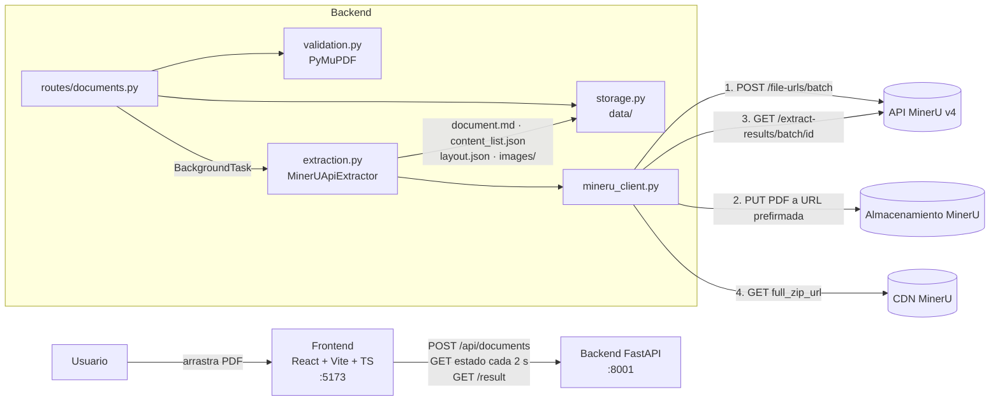
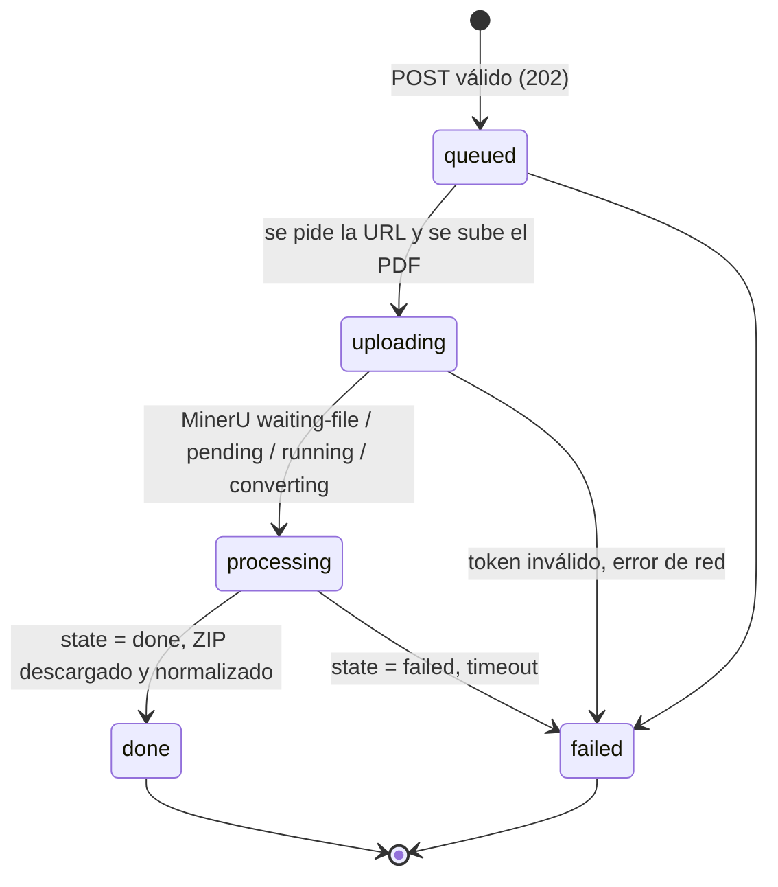

# Avances del Prototipo 1: Infraestructura web y extracción de PDF

**Trabajo Terminal:** Generación de Grafos de Conocimiento a partir de Documentos PDF mediante LLM y NLP
**Alumno:** González Arellano Jesús Ángel
**Etapa:** TT I, Prototipo 1 (protocolo §5.1.1)
**Fecha:** octubre de 2026

---

## 1. Objetivo y alcance

> "Construir el primer prototipo funcional que integre la arquitectura base de la aplicación web (frontend y backend) y el módulo de extracción de texto a partir de documentos PDF." (Protocolo §5.1.1)

**Qué incluye:**
- API REST para subir PDFs y consultar su extracción.
- Integración con MinerU para extraer texto, títulos, tablas, imágenes y fórmulas, con salida en Markdown y JSON.
- Interfaz web con carga, progreso y visualización.
- Pruebas automatizadas.
- Script de evaluación de fidelidad (CER, objetivo 2.1.1).

**Qué no incluye (acordado):** la base de datos de grafos (Neo4j). Se pospone al Prototipo 3, cuando existan tripletas que almacenar. En P1 los resultados se guardan en el sistema de archivos.

## 2. Decisiones técnicas

| Decisión | Alternativas consideradas | Justificación |
|---|---|---|
| **FastAPI** (Python 3.12) | Flask, Django | Requisito del proyecto. Validación con Pydantic, OpenAPI/Swagger automático y soporte asíncrono nativo, útil para consultar el estado de un servicio externo sin bloquear |
| **React + Vite + TypeScript** | Create React App, JS puro | CRA está descontinuado y Vite es el estándar actual. TypeScript tipa el contrato con la API (`src/types.ts`) |
| **API en la nube de MinerU** en lugar de MinerU local | MinerU local en CPU; PyMuPDF / pymupdf4llm; Marker; Nougat | El equipo no tiene GPU (Intel HD 520), tiene 7 GB de RAM y ~6 GB libres en disco. MinerU local descarga varios GB de modelos y en CPU tarda minutos por documento. La API ofrece el mismo motor (`pipeline` o `vlm`) sin requisitos locales |
| **Extractor detrás de una interfaz** (`Extractor` en `services/extraction.py`) | Llamar a MinerU directamente desde la ruta | Permite cambiar a MinerU local u otro motor sin tocar rutas ni frontend, y simular MinerU en las pruebas |
| **Procesamiento asíncrono con consulta de estado** | Respuesta síncrona | La extracción tarda de segundos a minutos. `POST` responde `202` de inmediato y el frontend consulta el estado cada 2 s |
| **Markdown + JSON** | Solo uno de los dos | El Markdown (`document.md`) sirve para leer y visualizar. El JSON (`content_list.json`) conserva el tipo de bloque, la página y el nivel de título, que es la entrada que necesita el pipeline de NLP del Prototipo 2 |
| **Persistencia en disco** (`metadata.json` por documento) | SQLite, Neo4j | Suficiente para el prototipo y sobrevive a reinicios. La BD se diseñará con el modelo del grafo (P3) |
| **Validación con PyMuPDF** antes de enviar | Confiar en MinerU | Rechaza pronto (y sin gastar cuota de MinerU) archivos que no son PDF, están dañados, cifrados, vacíos o exceden 200 páginas |

## 3. Arquitectura

### Ciclo de vida de un documento

Si el servidor se reinicia con extracciones a medias, al arrancar se marcan como `failed` con un mensaje que pide volver a subir el archivo.

### Estructura de módulos

| Capa | Archivo | Responsabilidad |
|---|---|---|
| Configuración | `app/core/config.py` | Lee `.env` con pydantic-settings |
| Errores | `app/core/errors.py` | Jerarquía `AppError` y formato `{"error": {code, message}}` |
| Rutas | `app/api/routes/documents.py` | Endpoints REST |
| Esquemas | `app/schemas/document.py` | Modelos de respuesta |
| Modelo | `app/models/job.py` | Estado del job |
| Servicios | `app/services/validation.py` | Validación del PDF |
| | `app/services/mineru_client.py` | Cliente HTTP de MinerU y traducción de sus códigos de error |
| | `app/services/extraction.py` | Orquestación, descompresión segura del ZIP y estadísticas |
| | `app/services/storage.py` | Persistencia en disco con escritura atómica |
| Frontend | `src/api/client.ts` | Cliente HTTP; la subida usa XHR para reportar progreso |
| | `src/components/*` | `UploadForm`, `ProgressIndicator`, `ResultViewer`, `DocumentList` |

## 4. API REST

| Método | Ruta | Respuesta |
|---|---|---|
| `POST` | `/api/documents` | `202` con `DocumentStatus`; `422` si el archivo no es válido; `413` si es demasiado grande |
| `GET` | `/api/documents` | Lista de `DocumentStatus` |
| `GET` | `/api/documents/{id}` | `DocumentStatus` (`status`, `progress.extracted_pages/total_pages/remote_state`, `error`); `404` si no existe |
| `GET` | `/api/documents/{id}/result` | `{markdown, content_list, stats, assets_base_url}`; `409` si no ha terminado o falló |
| `GET` | `/api/documents/{id}/assets/images/…` | Imagen extraída; solo sirve archivos dentro de `images/` |
| `GET` | `/api/health` | `{status, mineru_token_configured, mineru_model_version}` |

La documentación interactiva está en `http://localhost:8001/docs`.

## 5. Instrucciones de uso

Ver `README.md` para el detalle. En resumen:

1. `cp backend/.env.example backend/.env` y pegar el token de MinerU.
2. Terminal 1: `source ~/venvs/pipeline/bin/activate && cd backend && uvicorn app.main:app --port 8001 --reload`.
3. Terminal 2: `cd frontend && npm install && npm run dev`.
4. Abrir `http://localhost:5173`, arrastrar un PDF y pulsar **Extraer contenido**.
5. Revisar el resultado en las pestañas *Vista*, *Markdown*, *JSON estructurado* y *Estadísticas*, y descargarlo en `.md` o `.json`.

## 6. Pruebas

### 6.1 Pruebas automatizadas (`backend/tests`, `pytest`)

| Archivo | Qué cubre |
|---|---|
| `test_validation.py` | PDF válido (generado y el de ejemplo), extensión incorrecta, tipo MIME incorrecto, archivo vacío, firma ausente, PDF dañado, demasiado grande, demasiadas páginas, PDF cifrado |
| `test_extraction_flow.py` | Flujo completo con MinerU simulado (`respx`): subida → `pending` → `running` → `done` → ZIP → resultado e imagen servida. También: fallo reportado por MinerU, token inválido (`A0202`), timeout, falta de token, ZIP con subcarpeta y protección contra *zip slip*, cálculo de estadísticas |
| `test_api.py` | `/api/health`, rechazo de no-PDF (`422`), archivo demasiado grande (`413`), petición sin archivo, `404`, `409`, *path traversal* en `/assets`, jobs interrumpidos por reinicio |
| `test_eval_cer.py` | Normalización y cálculo de CER |
| `test_integration_mineru.py` | **API real de MinerU** con `samples/2027-A038.pdf` (`pytest -m integration`) |

**Resultado:** 27 pruebas unitarias aprobadas (`pytest`, ~1 s). Frontend: `npm run build` (TypeScript + Vite) sin errores.

### 6.2 Prueba con MinerU real

_Pendiente de completar; ver la Sección 8._

## 7. Problemas encontrados y soluciones

| Problema | Solución |
|---|---|
| El equipo no tiene GPU y tiene poco disco, así que MinerU local es inviable | Se usa la API en la nube de MinerU; el extractor queda detrás de una interfaz para poder cambiarlo |
| La URL prefirmada de subida rechaza cabeceras extra | El `PUT` se envía sin `Content-Type` ni `Authorization` (lo verifica una prueba) |
| Justo después de subir, MinerU puede no listar todavía el archivo o reportar `waiting-file` | Se trata como estado intermedio y se sigue consultando |
| Las URLs de resultados de MinerU caducan | El ZIP se descarga y se guarda localmente en cuanto termina la extracción |
| El ZIP puede traer subcarpetas y nombres con prefijo (`<uuid>_content_list.json`) | Se normaliza a `document.md`, `content_list.json`, `layout.json` e `images/`; se ignoran rutas que intenten salir de la carpeta (*zip slip*) |
| El Markdown de MinerU referencia imágenes relativas (`images/x.jpg`) y tablas en HTML | El backend sirve `/assets/images/...` y el frontend reescribe las URLs. Las tablas HTML se renderizan con `rehype-raw` y se filtran con `rehype-sanitize` para evitar inyección de HTML/JS |
| La extracción puede tardar minutos y la espera parecía un bloqueo | Progreso visible por etapas y por página, y registro en los logs de cada cambio de estado de MinerU |
| El puerto 8000 estaba ocupado en el equipo de desarrollo | El backend se ejecuta en el 8001; el proxy de Vite apunta a ese puerto (configurable con `BACKEND_URL`) |
| El PDF de ejemplo tiene 9 páginas, no 8 (la última está prácticamente vacía) | Se ajustó la prueba |

## 8. Resultados

_Pendiente de completar._

## 9. Siguientes pasos (Prototipo 2)

- Discutir con el sinodal `docs/prototipo2_opciones_extraccion_entidades.md` (tipología de entidades, enfoque y protocolo de evaluación).
- Anotar el conjunto de evaluación de entidades (P/R/F1 por tipo y por dominio).
- Implementar la segmentación a partir de `content_list.json` (secciones, exclusión de encabezados y pies de página, tablas).
- Calcular el CER sobre transcripciones manuales de páginas de distintos tipos de documentos (una columna, dos columnas, con tablas, escaneado) para el objetivo 2.1.1.
